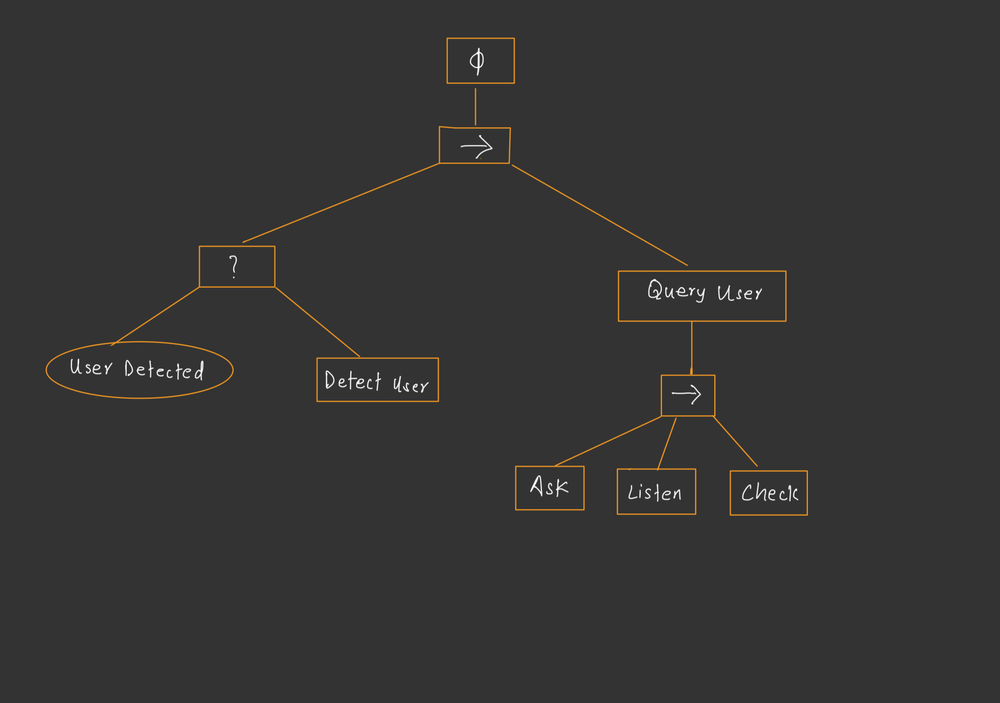

# Sota Quiz Interaction Project

This project implements a behavior for the **Sota robot** that allows it to detect a user and engage them in a cheerful **quiz game**. The robot uses simple affective feedback, speech synthesis, motion gestures, and basic keyword recognition to create an interactive and friendly user experience.

---

## 👾 Features

- **Motion Detection:** Sota detects user presence to initiate interaction.
- **Quiz Game Interaction:** A short quiz with keyword-based answer recognition.
- **Affective Feedback:** Uses gestures and expressive responses to encourage or comfort.
- **Voice Synthesis:** Baby-style speech generated using [TTSMaker](https://ttsmaker.com/).
- **Keyword Recognition:** Implemented using PocketSphinx.

---

## 🎯 Goals

- Make Sota appear as an empathetic and humorous companion.
- Encourage user engagement with friendly dialog and fun interactions.
- Apply Human-Robot Interaction (HRI) principles such as:
  - **User-Centered Design**
  - **Situation Awareness**
  - **Affective Design**
  - **Animorphism**

---

## 🧠 Behavior Overview

1. **Detection:** Sota uses motion detection to spot a nearby user.
2. **Greeting:** It greets the user and proceeds to the quiz game.
3. **Quiz Flow:**
   - Asks a question.
   - Listens for a one-word answer using keyword spotting.
   - Responds with a cheer or comfort motion based on correctness.
4. **Fallback (Planned but Removed):**
   - Originally included a conversation path (e.g., asking “How was your day?”) but was dropped due to technical limitations in language understanding and processing power.

---

## 🌲 Behavior Tree Changes

**Initial Plan:**
- Detection → Greeting → Choice: "talk" or "game"
  - **Talk branch:**
    - Ask about user’s day
    - Detect sentiment (positive/negative)
    - Offer comfort or follow-up
    - Option to play quiz
  - **Game branch:**
    - Directly begin the quiz
      

**Final Implementation:**
- Detection → Greeting → Quiz Game
  - Removed the "talk" conversation path due to:
    - Limitations in natural language understanding
    - Poor PocketSphinx performance on Sota’s hardware
    - Complexity of parsing open-ended responses

This simplification made the behavior more stable and focused on providing a fun, affective quiz experience.

---

## 🛠️ Technical Notes

- **Speech Recognition:** PocketSphinx was used for keyword spotting, though limited by hardware performance.
- **Voice Output:** Speech files were pre-generated using TTSMaker.
- **Behavior Tree:** A custom tree controls detection, interaction flow, and emotional response logic.
- **Face Detection:** Was partially implemented but excluded due to inconsistent results and hardware limitations.

---

## 🤝 Team

COMP4060 - Group 1

- Cuong Ta - 7900562
- Het Patel - 7972424
- Dipesh Shah - 7882947

---

## 📌 Lessons Learned

- Full natural conversation is harder than expected — we pivoted to focus on building a polished, interactive quiz.
- Working with real robot hardware requires adapting to limitations like imperfect cameras and constrained processing power.
- Good teamwork and iteration helped us deliver a satisfying final result.

---

## 📷 Demo

*(Add link here to any videos or GIFs if available)*

---
